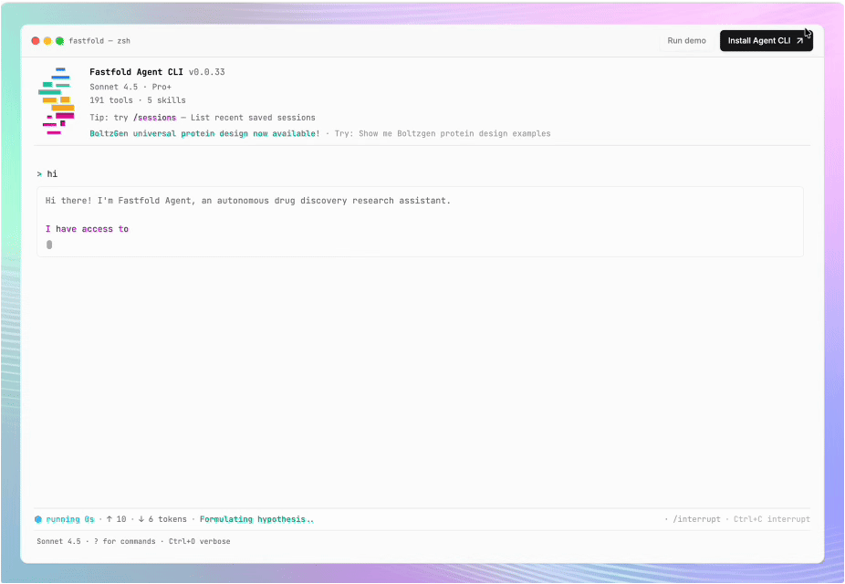
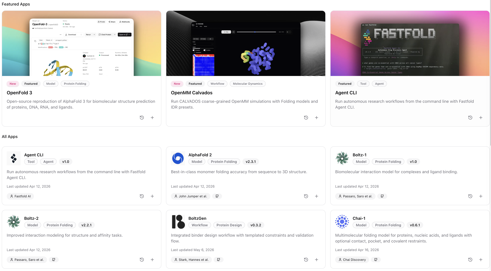

# Fastfold Agent CLI

<p align="center">
  <a href="https://github.com/fastfold-ai/fastfold-agent-cli/actions/workflows/ci.yml"></a>
  <a href="https://codecov.io/gh/fastfold-ai/fastfold-agent-cli"></a>
  <a href="https://skills.sh/fastfold-ai/skills"></a>
  <a href="https://pypi.org/project/fastfold-agent-cli/"></a>
  <a href="https://hub.docker.com/r/fastfold/fastfold-agent-cli"></a>
  <a href="https://fastfoldcommunity.slack.com/join/shared_invite/zt-3azbiw7qv-majshu97TymCma_TwFT6mw#/shared-invite/email"></a>
</p>



Fastfold Agent CLI is an agentic research environment for scientists in search of great tools, combining open-source skills and tools with Fastfold workflows, cloud services, and local or hosted LLMs.

It is built on CellType,[1](#notes) an open-source agent for computational biology that achieves a state-of-the-art **90% on BixBench-Verified-50**.[2](#notes)


### Why Fastfold CLI

You get the full open-source agent[1](#notes) with 190+ tools, 30+ database APIs, and multi-step planning, plus what Fastfold adds for composability and extensibility:

- **GPU compute models & workflows**: run heavy scientific workflows like folding, protein design, and MD simulation on Fastfold Cloud, your own compute, or providers like Modal, Nebius, and more.
- **Installable skills**: discover, add, and share workflows natively (`fastfold skills find`, `fastfold skills add <github url>`).
- **Any model**: Anthropic, OpenAI, or local/open models like Gemma, Qwen, and DeepSeek through endpoints like **Ollama** and **Unsloth** via `/model` or `fastfold setup`.

### Quick install

<details>
<summary>Install <code>uv</code> (for native CLI install)</summary>

- **Python 3.10+** (recommended: let `uv` install managed interpreters).
- **uv** — [Installing uv](https://docs.astral.sh/uv/getting-started/installation/). Quick options:

**Linux / macOS:**

```bash
curl -LsSf https://astral.sh/uv/install.sh | sh
```

**Windows (cmd/PowerShell):**

```powershell
powershell -ExecutionPolicy ByPass -c "irm https://astral.sh/uv/install.ps1 | iex"
```

Alternatively: `winget install --id=astral-sh.uv -e` (see Astral docs for other methods).

After installing `uv`, close and reopen your terminal or PowerShell so `PATH` picks up the `uv` executable.

</details>

**Linux / macOS:**

```bash
uv tool install "fastfold-agent-cli[all]" --python 3.10
```

**Windows (cmd/PowerShell):**

```bash
uv tool install "fastfold-agent-cli[win_build]" --python 3.10
```

<details>
<summary>Install via WSL2 + Ubuntu (full <code>[all]</code> stack, recommended)</summary>

`tiledbsoma` does not publish usable native Windows wheels, so `[all]` on cmd/PowerShell usually fails. Use WSL instead:

1. Install [WSL](https://learn.microsoft.com/en-us/windows/wsl/install) (Ubuntu recommended).
2. Open an **Ubuntu** terminal and install `uv` + Python (see [Prerequisites](#prerequisites) above).
3. Run the same install command inside WSL:

```bash
uv tool install "fastfold-agent-cli[all]" --python 3.10
```

</details>

### Docker

```bash
docker run -it --rm \
  -v fastfold-cli:/root/.fastfold-cli \
  fastfold/fastfold-agent-cli:latest
```

### Authentication

The interactive setup wizard is the easiest way to get started. It lets you pick provider(s) from a toggle list, then enter keys:

```bash
fastfold setup
```

To skip the toggle list, pass the provider(s) explicitly (comma-separated):

```bash
fastfold setup --provider anthropic
fastfold setup --provider openai
fastfold setup --provider openai_compatible
fastfold setup --provider anthropic,openai
```

Prefer environment variables? Set keys directly:

```bash
export ANTHROPIC_API_KEY="sk-ant-..."
export OPENAI_API_KEY="sk-..."
export FASTFOLD_API_KEY="sk-..."
```

For CI or scripting, pass keys non-interactively:

```bash
fastfold setup --api-key sk-ant-... --fastfold-api-key sk-...
fastfold setup --provider openai --openai-api-key sk-... --fastfold-api-key sk-...
```

Local/compatible endpoints can also be configured in one line:

```bash
fastfold setup --provider openai_compatible --openai-compatible-backend ollama --openai-base-url http://localhost:11434/v1
fastfold setup --provider openai_compatible --openai-compatible-backend unsloth --openai-base-url http://localhost:8888/v1
```

### Local and OpenAI-compatible models (Ollama, Unsloth, other gateways)

Fastfold supports local/self-hosted OpenAI-compatible endpoints in both `fastfold setup` and interactive `/model`.

Recommended (interactive):

```bash
fastfold setup --provider openai_compatible
```

The setup wizard will guide you through:

1. Endpoint type selection:
  - `Ollama` (`/api/tags`)
  - `Unsloth` (`/v1/models`, auth)
  - `Other OpenAI-compatible` (`/v1/models` then `/api/tags`)
2. Endpoint base URL:
  - Ollama default: `http://localhost:11434/v1`
  - Unsloth default: `http://localhost:8888/v1`
3. API key prompt (backend-aware):
  - Ollama commonly uses `ollama` placeholder key
  - Unsloth uses your Unsloth Studio key
4. Model discovery + selection from endpoint models (or manual model ID entry)

You can also configure directly:

```bash
# Ollama
fastfold config set llm.provider openai
fastfold config set llm.openai_base_url http://localhost:11434/v1
fastfold config set llm.openai_compatible_backend ollama
fastfold config set llm.openai_compatible_api_key ollama
fastfold config set llm.model llama3.1

# Unsloth
fastfold config set llm.provider openai
fastfold config set llm.openai_base_url http://localhost:8888/v1
fastfold config set llm.openai_compatible_backend unsloth
fastfold config set llm.openai_compatible_api_key sk-unsloth-...
fastfold config set llm.model <unsloth-model-id>
```

Environment variables for compatible endpoints:

```bash
export OPENAI_BASE_URL="http://localhost:11434/v1"
export OPENAI_COMPATIBLE_API_KEY="ollama"
```

Inside interactive mode, run `/model` to switch providers/models and re-run endpoint/model discovery at any time.

Provider selection:

```bash
fastfold config set llm.provider anthropic
fastfold config set llm.model claude-sonnet-4-5-20250929
fastfold config set llm.anthropic_api_key sk-ant-...

fastfold config set llm.provider openai
fastfold config set llm.model gpt-4o
fastfold config set llm.openai_api_key sk-...

# Legacy fallback (Anthropic only, still supported)
fastfold config set llm.api_key sk-ant-...
```

## Getting Started

```bash
# Start interactive session
fastfold

# Single query
fastfold "What are the top degradation targets for this compound?"

# Validate setup
fastfold doctor

# List available tools
fastfold tool list

# List loaded skills
fastfold skills list
```

### Interactive commands

Inside `fastfold` interactive mode (run `/help` for the full reference):

**Discover**

- `/help`: show command reference with examples
- `/tools`: list all tools with status (stable/experimental)
- `/skills`: list currently loaded skills
- `/skills-find [query]`: discover installable skills from the catalog
- `/skills-add <source>`: install a skill from GitHub/local path/name
- `/skills-remove <name>`: remove a globally-installed skill
- `/case-study`: run/list curated case studies (`/case-study list`)

**Models & configuration**

- `/model`: switch LLM model/provider interactively
- `/settings`: configure UI and agent preferences
- `/config`: show active runtime configuration
- `/keys`: show API key setup status by service

**Run control**

- `/agents N <query>`: run a query with N parallel research agents
- `/plan`: toggle plan mode (preview & approve before executing)
- `/interrupt`: interrupt the active generation (add `!` to force)
- `/compact`: compress session context for longer runs
- `/tasks`: show background task watcher status (`/tasks refresh` for live probe)

**Sessions & output**

- `/new`: start a new empty session
- `/sessions`: list saved sessions (or delete: `/sessions delete <id>`)
- `/resume`: resume a previous session by id/index
- `/usage`: show session token/cost usage
- `/copy`: copy the last answer to clipboard
- `/export`: export current session transcript to markdown
- `/export-share`: export session, send to Slack, and save to library
- `/notebook`: export current session as Jupyter notebook (`.ipynb`)

**Maintenance**

- `/upgrade`: upgrade `fastfold-agent-cli` via uv
- `/doctor`: run readiness diagnostics and fix hints
- `/autofix`: apply automatic local fixes for common runtime issues
- `/clear`: clear the screen
- `/exit`: exit the terminal

### Quick examples

**Target prioritization**

```
fastfold "I have a CRBN molecular glue. Proteomics shows it degrades
          IKZF1, GSPT1, and CK1α. Which target should I prioritize?"
```

**Protein folding**

```
fastfold "Fold this sequence with boltz-2 and find the binding pockets: MALWMRLLPLL..."
```

**Combination strategy**

```
fastfold "My lead compound is immune-cold. What combination strategy should I use?"
```

## Key Features

### 190+ Domain Tools


| Category       | Examples                                                                    |
| -------------- | --------------------------------------------------------------------------- |
| **Target**     | Neosubstrate scoring, degron prediction, co-essentiality networks           |
| **Chemistry**  | SAR analysis, fingerprint similarity, scaffold clustering                   |
| **Expression** | L1000 signatures, pathway enrichment, TF activity, immune scoring           |
| **Viability**  | Dose-response modeling, PRISM screening, therapeutic windows                |
| **Biomarker**  | Mutation sensitivity, resistance profiling, dependency validation           |
| **Clinical**   | Indication mapping, population sizing, TCGA stratification                  |
| **Safety**     | Anti-target flagging, multi-modal profiling, SALL4 risk                     |
| **Structure**  | AlphaFold fetch, docking, binding sites, MD simulation                      |
| **Folding**    | Fastfold AI Cloud: boltz-2, monomer, multimer, simplefold_*                 |
| **Literature** | PubMed, OpenAlex, ChEMBL search                                             |
| **DNA**        | ORF finding, codon optimization, primer design, Gibson/Golden Gate assembly |


### Agent Skills

Fastfold ships with a bundled skill catalog and lets you discover, add, and manage skills natively. Installed skills live in `~/.fastfold-cli/skills/` and are picked up automatically.

List what's loaded:

```bash
fastfold skills list
```

Discover skills from the catalog:

```bash
fastfold skills find                 # browse all
fastfold skills find "protein design"  # filter by query
```

Add a skill from a GitHub URL, `owner/repo@subpath`, a local path, or a catalog name:

```bash
fastfold skills add https://github.com/fastfold-ai/skills/tree/main/skills/fold
fastfold skills add fastfold-ai/skills@skills/fold
fastfold add skills ./my-skill        # alias for `skills add`
```

Keep skills current (sync the Fastfold catalog — adds new + updates existing — and re-install other tracked skills):

```bash
fastfold skills upgrade                 # sync catalog + update installed
fastfold skills upgrade --catalog-only  # only refresh the Fastfold catalog
fastfold skills upgrade --no-catalog    # only update already-installed skills
```

Inspect or remove:

```bash
fastfold skills info fold
fastfold skills remove fold
fastfold skills delete --all   # remove ALL user-installed skills (asks to confirm)
```

Inside the interactive session you can use the slash commands `/skills`, `/skills-find [query]`, `/skills-add <source>`, and `/skills-remove <name>`. Install uses a native `git clone` and falls back to `npx skills add` (skills.sh) when needed.

`fastfold setup` also offers to install skills interactively — it live-fetches the current Fastfold catalog, lets you multi-select, suggests the community collections below, and accepts custom sources. It prefers `npx skills add` when Node is available, otherwise uses `git`. Non-interactive: `fastfold setup --skills "fastfold-ai/skills@skills/fold,..."` or `--skip-skills`.

#### Community skill collections

You can also install skills from other providers. Each command installs the whole collection (use `npx skills add ...` instead if you prefer Node):

- **K-Dense-AI** — scientific agent skills ([repo](https://github.com/K-Dense-AI/scientific-agent-skills))

```bash
fastfold skills add K-Dense-AI/scientific-agent-skills
```

- **Anthropic** — life-sciences skills ([repo](https://github.com/anthropics/life-sciences#skills))

```bash
fastfold skills add anthropics/life-sciences
```

- **DeepMind** — science skills ([repo](https://github.com/google-deepmind/science-skills))

```bash
fastfold skills add google-deepmind/science-skills
```

**Create your own skill** with the bundled `skill-creator` (scaffold, validate, package), and let the agent discover skills via the `find-skills` skill. To let the agent install skills itself, enable `fastfold config set skills.allow_agent_install true`.

### Data Management

```bash
fastfold data pull depmap    # DepMap CRISPR, mutations, expression
fastfold data pull prism     # PRISM cell viability
fastfold data pull msigdb    # Gene sets
fastfold data pull alphafold     # Protein structures (on-demand)

# Or point to existing data
fastfold config set data.depmap /path/to/depmap/
```

### Reports

```bash
fastfold report list         # list reports
fastfold report publish      # convert latest .md to .html
fastfold report show         # open in browser
```

### Explore Fastfold Apps

Browse the Fastfold Apps catalog at [https://cloud.fastfold.ai/apps](https://cloud.fastfold.ai/apps)
- Fold model options include: ESM-1b, IntelliFold, OpenFold 3, AlphaFold2, Boltz-1, Boltz-2, Chai-1, and SimpleFold.
- MD workflow options include: OpenMM Calvados and OpenMMDL.
- Protein Design workflows coming soon: Boltzgen and Bindcraft.




## Contributing

Contributions are welcome, from bug reports and docs fixes to new tools and skills.

Clone the repo and set up a development environment:

```bash
git clone https://github.com/fastfold-ai/fastfold-agent-cli.git
cd fastfold-agent-cli
uv venv --python 3.12 && uv sync
fastfold setup
```

Run the test suite before opening a PR:

```bash
pytest tests/          # full suite
pytest tests/ -v       # verbose
pytest tests/test_cli.py::test_name   # a single test
```

Adding a new tool? Tools live in `src/tools/` and register with the `@registry.register(...)` decorator. Each tool's name prefix must match its category, it should accept `**kwargs`, and it must return a dict with a `"summary"` key. Use lazy imports for data loaders inside the function body. See `CLAUDE.md` for the full tool pattern and conventions.

A few guidelines:

- Keep changes focused and add tests for new behavior (tests mock data loaders, so they don't require real datasets).
- Match the existing code style and run `pytest` locally until green.
- Open a PR with a clear description of the change and why it's needed.

## License

MIT

## Notes

1. Agent foundation and capabilities ("Why ct"): [github.com/celltype/celltype-agent#why-ct](https://github.com/celltype/celltype-agent#why-ct)
2. Benchmark — 90% on BixBench-Verified-50, as reported upstream: [github.com/celltype/celltype-agent#benchmark](https://github.com/celltype/celltype-agent#benchmark)

